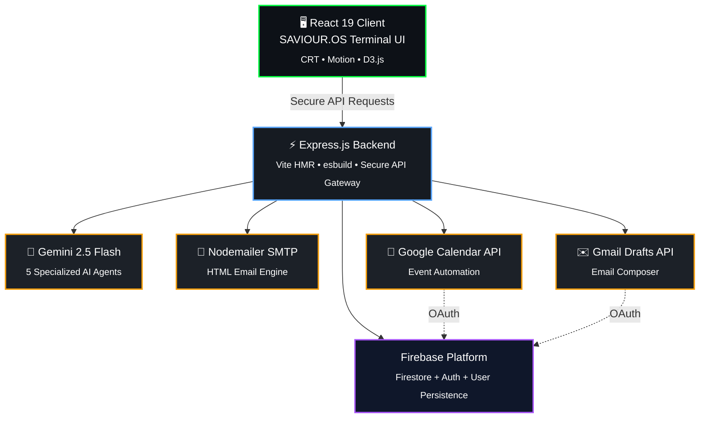

<div align="center">

```
 ███████╗ █████╗ ██╗   ██╗██╗ ██████╗ ██╗   ██╗██████╗      ██████╗ ███████╗
 ██╔════╝██╔══██╗██║   ██║██║██╔═══██╗██║   ██║██╔══██╗    ██╔═══██╗██╔════╝
 ███████╗███████║██║   ██║██║██║   ██║██║   ██║██████╔╝    ██║   ██║███████╗
 ╚════██║██╔══██║╚██╗ ██╔╝██║██║   ██║██║   ██║██╔══██╗    ██║   ██║╚════██║
 ███████║██║  ██║ ╚████╔╝ ██║╚██████╔╝╚██████╔╝██║  ██║    ╚██████╔╝███████║
 ╚══════╝╚═╝  ╚═╝  ╚═══╝  ╚═╝ ╚═════╝  ╚═════╝ ╚═╝  ╚═╝     ╚═════╝ ╚══════╝
```

# SAVIOUR.OS — The Atmospheric Deadline Shield Terminal
### *PROTOCOL-V2.6 · AUTONOMOUS LIFE SENTINEL ACTIVE*

[](https://saviour-ai-260245018870.us-west1.run.app/) [](https://blockseblock.com)

[](https://ai.google.dev/)
[](https://react.dev/)
[](https://cloud.google.com/run)
[](https://firebase.google.com/)
[](https://www.typescriptlang.org/)
[](LICENSE)

</div>

---

> **"The moment a deadline starts slipping is exactly when most tools go silent. Saviour AI does the opposite — it deploys 5 autonomous agents to plan, intervene, and recover."**

---

## 📌 Hackathon Context

| Category | Details |
|-----------|----------|
| 🏆 Event | **Vibe2Ship 2026 – India's Biggest Vibe-Coding Hackathon** |
| 🤝 Organizers | **Coding Ninjas 10X Club × Google for Developers** |
| 🎯 Track | **The Last-Minute Life Saver** |
| 🚀 Project | **SAVIOUR.OS — The Atmospheric Deadline Shield Terminal** |
| 🌐 Live Demo | https://saviour-ai-260245018870.us-west1.run.app/ |
| ☁️ Deployment | **Google Cloud Run** via **Google AI Studio Build Pipeline** |

---

## 🎯 Problem Statement

Students, professionals, and entrepreneurs routinely miss deadlines because **existing productivity tools are built on a passive pull architecture** — they wait for users to check them. When stress hits, users avoid their dashboards entirely (the "Ostrich Effect"). When a deadline slips, there is no Plan B.

Three real failures of traditional tools:
- **Reminder Fatigue** — passive notifications are dismissed in under 2 seconds
- **The Ostrich Effect** — approaching deadlines increase anxiety, causing active dashboard avoidance  
- **No Recovery Protocol** — zero structured help after a deadline is missed

---

## Solution Architecture

Saviour AI is built around a **Hybrid Active-Mitigation OS** — user-in-the-loop agency combined with server-side Gemini reasoning that activates proactively, not reactively.

## 🏗️ SAVIOUR.OS Architecture


## 🤖 The 5 Autonomous Agents

Each agent is a **separate structured-output Gemini endpoint** — not a single chatbot wrapper. This separation allows each agent to specialize and return typed JSON that maps directly onto UI state.

| Agent | Endpoint | Specialization |
|---|---|---|
| **Task Breakdown Agent** | `POST /api/gemini/breakdown` | Slices any task into 3–5 procrastination-defeating subtask milestones using `responseSchema` JSON |
| **Delay Mitigation Agent** | `POST /api/gemini/mitigate` | Drafts polished extension emails or strict 4-step rescue action plans on demand |
| **Companion Chat Agent** | `POST /api/gemini/chat` | Holds live task context, responds with natural language + `suggestedActions[]` that trigger real UI state changes |
| **Auto-Scheduler Agent** | `POST /api/gemini/auto-schedule` | Scans full task list for timeline conflicts, proposes and explains deferrals to protect high-stakes work |
| **Crisis Triage Agent** | `POST /api/gemini/triage` | Activates post-deadline: classifies severity, generates 3-step recovery plan, drafts stakeholder email, delivers mindset coaching |

All agents use `responseMimeType: 'application/json'` + `responseSchema` (Gemini structured output) so model output maps **directly and reliably** onto UI state without string parsing.

---

## ⚡ Feature Ecosystem

### 1. SAVIOUR.OS Terminal Boot Loader
- Immersive cyberpunk CRT login screen with scanline atmospheric overlays
- "DEFEAT DEADLINES BEFORE THEY DEFEAT YOU" — full-viewport typographic hero
- Google OAuth boot sequence + Anonymous Sentinel demo mode
- Developer sandbox bypass (email-based persistent session for restricted iframe environments)

### 2. Master Control Deck (Command Center)
- Real-time system clock, active task density monitor, risk factor readout
- Inline natural-language console — type `/plan_day`, `/breakdown`, `/start_focus`
- 5-Agent sentinel grid status panel
- XP progress, streak multiplier, and level system visible at all times

### 3. Deadlines Checklist (Task Matrix)
- **Urgency partitioning**: CRITICAL (< 24h), URGENT (< 3d), NORMAL
- **AI Autocut**: 1-click Gemini subtask generation with completion tracking
- **Crisis Triage mode**: Toggle to unlock per-card diagnostic suite
- Priority dot system with urgency pulse ring on critical items
- Inline extension email drafting + Gmail draft push
- Google Calendar sync per task

### 4. Autopilot Timeline (Scheduler)
- Visual timeline with conflict detection
- Gemini-powered auto-realignment with explanation
- 1-click sync to Google Calendar

### 5. Pomodoro Focus (Rescue Mode)
- SVG radial timer with color-coded session states (focus / short break / long break)
- AI coach quotes cycling every session
- Ambient noise synthesizer (Rain, Cosmic Static, Cyber-Cafe, Synth-Wave)
- Guided breathing loop visualization during breaks
- XP awarded on session completion

### 6. Sentinel AI Chat (Terminal Interface)
- Retro terminal CLI feel — `$ CMD >` input, monospace agent responses
- 5 selectable agent personas (Rogue, Guardian, Strategist, Auditor, Saviour)
- Suggested action pills that trigger real in-app state changes (not just text)
- Web Speech API voice input — dictate commands hands-free
- Typing indicator with 3-dot animation while Gemini generates

### 7. Habit Recurrence (Gamification Engine)
- GitHub-style 30-day activity heatmap
- XP + Level system (1–100), streak multipliers
- Unlockable operational badges (*Procrastination Slayer*, *Crisis Commander*)
- Goal frequency tracking (daily / weekly / monthly)

### 8. Operations Stats (Analytics Panel)
- `recharts` + `d3` real-time telemetry: completed vs outstanding, XP velocity, focus block metrics
- On-time completion rate, streak analytics

### 9. Google Workspace Connector
- Standard OAuth + Developer Bypass dual-mode authentication
- Calendar event creation from tasks
- Gmail draft composition from AI-generated mitigation emails
- Nodemailer HTML "rescue checklist" transactional emails with simulated-send fallback

---

## Google Technologies Used

| Technology | How It's Used |
|---|---|
| **Gemini 2.5 Flash** (`@google/genai` SDK) | Powers all 5 reasoning agents server-side with structured JSON-schema responses via `responseMimeType` + `responseSchema` |
| **Google Calendar API** | `calendar.events` scope — syncs task deadlines and recovery sessions to the user's real Google Calendar |
| **Gmail API** | `gmail.compose` scope — agent-generated extension requests and crisis emails as real Gmail drafts |
| **Google OAuth 2.0** | `openid / profile / email` scopes via Firebase's Google provider; dual-mode with Developer Bypass for sandbox environments |
| **Google Cloud Run** | Production deployment via `gcloud run deploy --source .` — containerized Express + Vite static serving |
| **Google AI Studio** | Build and deploy pipeline; app generated and deployed using the AI Studio repository template |
| **Firebase Authentication** | Google OAuth sign-in, session management, per-user data isolation |
| **Firebase Firestore** | Real-time persistence for tasks, goals, habits, badges, notifications, sync state |

---

##  Technical Stack

### Frontend
- React 19 + Vite — zero-latency local dev, optimized production build
- TypeScript (strict mode, `tsc --noEmit` gate on all PRs)
- Tailwind CSS v4 — cyberpunk green-on-black design system with custom `@theme` tokens
- `motion/react` (Framer Motion v12) — page transitions, stagger animations, layout animations
- `recharts` + `d3` — analytics telemetry charts
- `lucide-react` — icon system

### Backend
- Node.js + Express — API proxy architecture keeping all secrets server-side
- `@google/genai` SDK — Gemini structured output with `responseSchema` + `Type`
- Nodemailer — HTML transactional email (SMTP / simulated-send fallback)
- `esbuild` — bundles `server.ts` → `dist/server.cjs` for Cloud Run cold-start optimization
- `tsx` — TypeScript dev runtime

### Data & Auth
- Firebase Authentication — Google OAuth identity
- Firebase Firestore — real-time NoSQL persistence

---

## Module Breakdown

```
src/
├── App.tsx                    # Root orchestrator — auth, routing, state sync
├── components/
│   ├── MasterControlDeck.tsx  # Command center HUD + system console
│   ├── TaskBoard.tsx          # Urgency-sliced task matrix + AI autocut
│   ├── SchedulerView.tsx      # Timeline conflict scanner + auto-aligner
│   ├── AIAgentCompanion.tsx   # 5-agent terminal chat + voice input
│   ├── PomodoroRescue.tsx     # Focus timer + ambient sound + breathing loop
│   ├── HabitGoalTracker.tsx   # Gamification engine + activity heatmap
│   ├── AnalyticsPanel.tsx     # Recharts telemetry dashboard
│   ├── WorkspaceConnector.tsx # Google OAuth + Calendar/Gmail integration
│   ├── NotificationCenter.tsx # Alert panel with AI intervention log
│   └── ui/
│       ├── BentoGrid.tsx      # Stagger-animated bento card layout
│       ├── CTAButton.tsx      # Design-system button (primary/secondary/ghost/danger)
│       ├── PillBadge.tsx      # Contextual status badges
│       └── ListRow.tsx        # Reusable task list row
server.ts                      # Express API proxy (5 Gemini endpoints + email)
```

---

##  Google Workspace Integration

Saviour AI uses a **dual-mode authentication** architecture designed to work in all environments — local dev, restricted cloud sandboxes, and production.

### Mode A — Standard Google OAuth
```
Scopes: openid profile email
        https://www.googleapis.com/auth/calendar.events
        https://www.googleapis.com/auth/gmail.compose
```
Firebase Google provider initiates the OAuth popup flow and attaches workspace credentials.

### Mode B — Developer Bypass (for restricted sandbox iframes)
1. Go to [Google OAuth Playground](https://developers.google.com/oauthplayground)
2. Authorize `calendar.events` + `gmail.compose` scopes
3. Exchange for Access Token (`ya29.` prefix)
4. Paste into the Developer Bypass panel inside Saviour AI
5. Instant credential channel — no redirect required

---

## 🚀 Local Setup

```bash
# 1. Clone the repository
git clone https://github.com/manishpatel00/Saviour-AI-The-Last-Minute-Life-Saver.git
cd Saviour-AI-The-Last-Minute-Life-Saver

# 2. Install dependencies
npm install

# 3. Configure environment
cp .env.example .env
# Edit .env — add your GEMINI_API_KEY at minimum

# 4. Start full-stack dev server (Express + Vite HMR)
npm run dev
# → Open http://localhost:3000
```

### Environment Variables (`.env`)

```env
# Required — Gemini AI API key (server-side only, never VITE_ prefix)
GEMINI_API_KEY=your_gemini_api_key_here

# Optional — SMTP email (falls back to simulated-send if empty)
SMTP_HOST=smtp.gmail.com
SMTP_PORT=587
SMTP_USER=your_email@gmail.com
SMTP_PASS=your_app_password_here

# App base URL
APP_URL=http://localhost:3000
```

```bash
# Type check
npm run lint

# Production build (Vite static + esbuild server bundle)
npm run build

# Start production server
npm run start
```

---

## ☁️ Cloud Deployment

```bash
# Authenticate GCloud CLI
gcloud auth login
gcloud config set project YOUR_PROJECT_ID

# Enable required services
gcloud services enable run.googleapis.com \
                       containerregistry.googleapis.com \
                       firestore.googleapis.com

# Deploy to Cloud Run (source-based — no Dockerfile needed)
gcloud run deploy saviour-os \
  --source . \
  --port 3000 \
  --env-vars-file .env \
  --allow-unauthenticated \
  --region us-central1
```

> **Live instance:** [https://saviour-ai-260245018870.us-west1.run.app/](https://saviour-ai-260245018870.us-west1.run.app/)

---

## 🏆 Evaluation Grid Alignment

| Criteria | Weight | How Saviour AI Achieves |
|---|:---:|---|
| **Problem Solving & Impact** | 20% | Transforms passive reminder fatigue into an active 5-agent recovery OS. Handles the full lifecycle: planning → crisis → recovery. Zero passive-only features. |
| **Agentic Depth** | 20% | 5 separate Gemini endpoint agents (breakdown, mitigate, chat, schedule, triage). Each returns structured JSON that maps directly onto UI state changes — not just text responses. |
| **Innovation & Creativity** | 20% | Cyberpunk CRT terminal HUD, real-time ambient sound synthesizer, guided breathing loops, GitHub-style habit heatmap, voice command input, Developer Bypass auth for sandbox environments. |
| **Usage of Google Technologies** | 15% | Gemini 2.5 Flash (structured output), Google Calendar API, Gmail Compose API, Firebase Auth + Firestore, Google Cloud Run deployment, Google OAuth 2.0, AI Studio build pipeline. |
| **Product Experience & Design** | 10% | Full-viewport immersive boot loader, SAVIOUR.OS terminal theme, Framer Motion stagger animations, 44px+ touch targets, responsive bento grid, skeleton loaders, empty states. |
| **Technical Implementation** | 10% | 100% TypeScript strict mode (0 lint errors). esbuild pipeline for CJS server bundling. Structured Gemini JSON schema responses. Firebase real-time sync. Dual-auth security architecture. |
| **Completeness & Usability** | 5% | Every feature is functional — no mock endpoints. Anonymous demo mode. Developer bypass for evaluators. Nodemailer fallback. Working Calendar + Gmail integration with token bypass. |

---

## 🎨 Visual Design System

SAVIOUR.OS uses a custom cyberpunk design system defined in `src/index.css`:

- **Primary accent:** `#00ff41` — matrix green, used for active states, CTAs, and agent outputs
- **Background:** `#0a0a0a` — near-black canvas with scanline atmospheric overlay
- **Terminal font:** JetBrains Mono — all agent text, timestamps, CLI prompts
- **Display font:** Space Grotesk — system headers and section titles
- **Scanlines:** CSS `repeating-linear-gradient` overlay for CRT authenticity
- **Glow effects:** `box-shadow` with green tint on active cards and selected nav items
- **44px minimum touch targets** — accessibility-compliant on all interactive elements

---

<div align="center">

**SAVIOUR.OS** — *Dismantling procrastination. Automating crisis recovery. Protecting developer momentum.*

Made with ⚡ by [Manish Kumar](https://github.com/manishpatel00) for Vibe2Ship Hackathon 2026

[](https://saviour-ai-260245018870.us-west1.run.app/)

</div>
